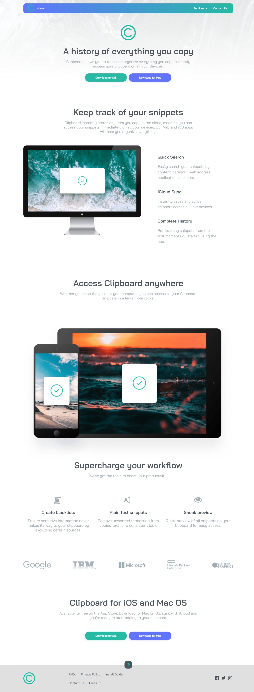

# Frontend Mentor - Clipboard landing page solution

This is a solution to the [Clipboard landing page challenge on Frontend Mentor](https://www.frontendmentor.io/challenges/clipboard-landing-page-5cc9bccd6c4c91111378ecb9). Frontend Mentor challenges help you improve your coding skills by building realistic projects. 

## Overview

### The challenge

Users should be able to:

- View the optimal layout for the site depending on their device's screen size
- See hover states for all interactive elements on the page

### Screenshot

## My process

- Completed

### Built with

- HTML5
- CSS3
- Flexbox
- Mobile-first workflow
- javascript

### Continued development

- css grid 
- javascript

### Useful resources

- [html-css-js](https://html-css-js.com/css/generator/box-shadow/) - This helped me for creating box shadows reason.
- [materialui](https://materialui.co/colors) - This helped me for Having many colors reason.

## Author

- Frontend Mentor - [@RohamMosa7274](https://www.frontendmentor.io/profile/RohamMosa7274)
- github - [@Roham Mosa](https://www.twitter.com/yourusername)
- Linkedin - [@roham mosa](www.linkedin.com/in/roham-mosa-aa87522a9)
